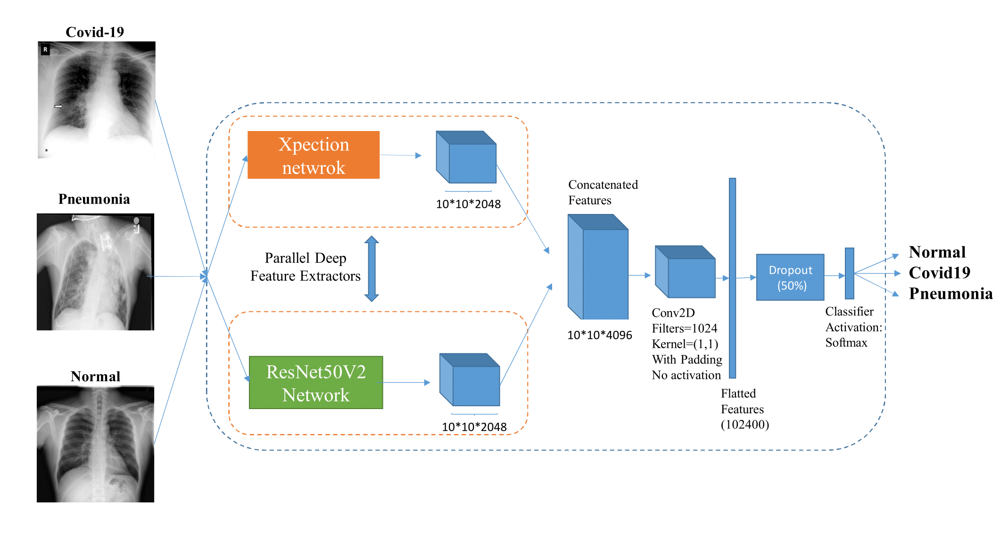
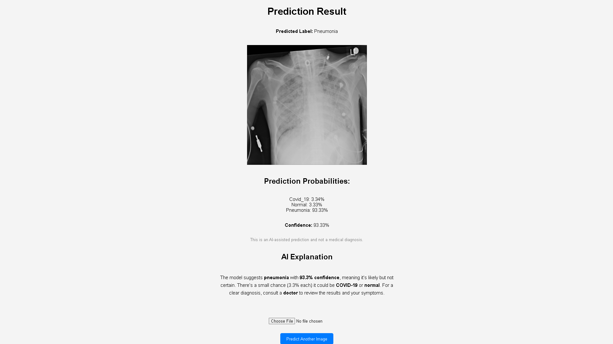

# A deep learning-powered web application for classifying chest X-ray images into COVID-19, Pneumonia, and Normal cases.
- Achieves ~99.5% classification accuracy on 10k+ images  
- Supports real-time inference via Flask API (~100ms latency)  
- Outputs probabilistic predictions for improved interpretability  
- Extended with LLM-based diagnostic summarization (2026)

## Notes
Originally developed as a 2-person university project (2024). The codebase has been recently refactored and documented to reflect production-oriented structure and deployment practices.

## My Contributions
- Led the development of the Flask-based inference API  
- Implemented the image preprocessing and prediction pipeline  
- Integrated the trained deep learning model into the deployment workflow  
- Contributed to designing the workflow from image upload to model prediction and result output
- (2026) Added LLM to generate human-readable diagnostic summary  

## System Workflow
1. User uploads chest X-ray image  
2. Image is preprocessed (resize, normalization, batching)  
3. Model performs classification using hybrid CNN architecture  
4. API returns predicted label + probability scores  
5. (2026) LLM generates human-readable diagnostic summary  

## Model Training

- The model was trained using data from [this dataset](https://github.com/lindawangg/COVID-Net/tree/master)

- The model training method follows the same approach as outlined in [this repository](https://github.com/mr7495/covid19). The methodology is detailed in the associated [research paper](https://www.sciencedirect.com/science/article/pii/S2352914820302537?via%3Dihub).

The model uses a concatenation of ResNet50V2 and Xception architectures to classify chest X-ray images into three classes: Normal, Pneumonia, and COVID-19.

<p align="center">
	
	<br>
	<em>The architecture of our model network</em>
</p>


## Installation

### Prerequisites

- Python 3.10+
- Flask
- TensorFlow 
- OpenCV
- Numpy

### Setup

1. Clone the repository:

   ```bash
   git clone https://github.com/lltlien/covid19-xray-detection-flask-app.git
   cd covid19-xray-detection-flask-app

2. Create and activate a virtual environment:

    ```bash
    virtualenv venv
    source venv/bin/activate  # On Windows, use `venv\Scripts\activate`

3. Install the required packages:

    ```bash
    pip install -r requirements.txt

4. Download model to `covid19-xray-detection-flask-app` folder: [This link](https://github.com/lltlien/covid19-xray-detection-flask-app/releases/download/lastest/concatenate-fold3.hdf5)

5. Run the application:

    ```bash
    python3 app.py

6. Open your web browser and go to http://127.0.0.1:5000/ to use the app.

<p align="center">
	
	<br>
	
	<br>
    <em>The simple web application</em>

</p>
